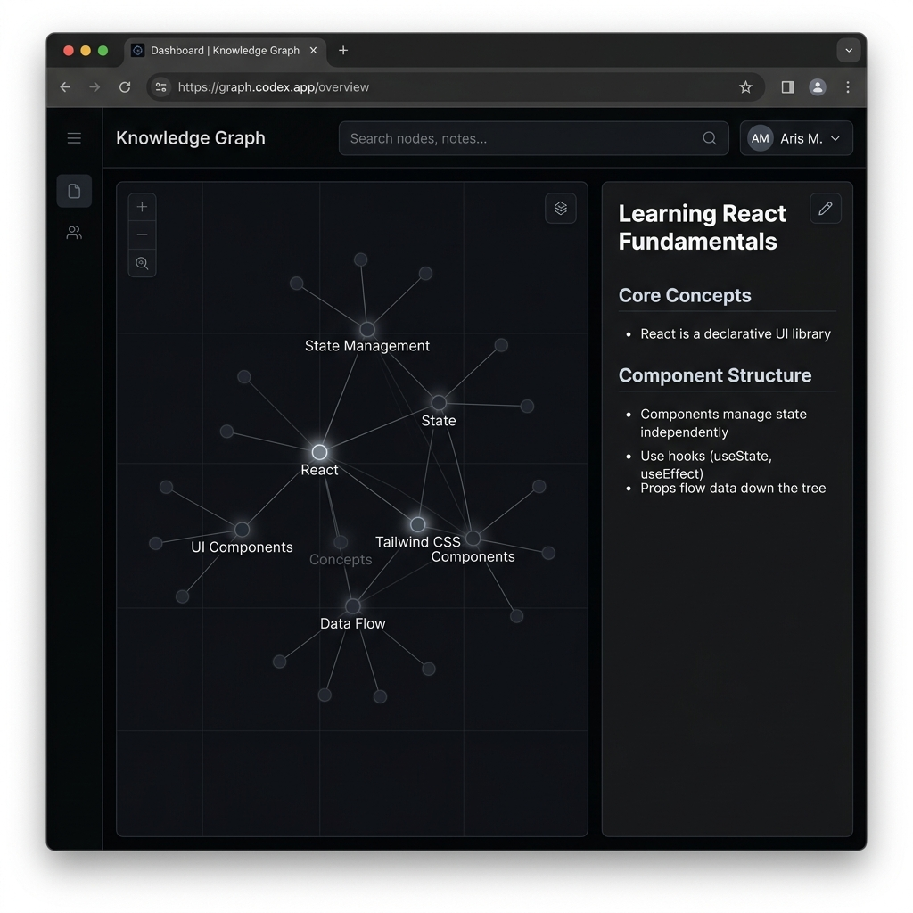
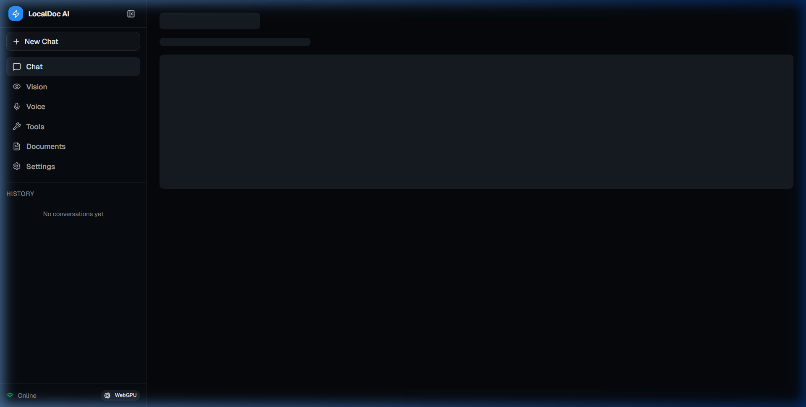

  

  <a href="https://harshhatela.in" target="_blank"><b>harshhatela.in</b></a> • 
  <a href="https://linkedin.com/in/harshhatela" target="_blank"><b>LinkedIn</b></a> • 
  <a href="mailto:hatelaharsh@gmail.com"><b>Email</b></a>

---

### 🌐 EXECUTIVE PROFILE

> **"Engineering high-fidelity web interfaces and local AI workspaces with mathematical precision and design-system discipline."**
> 
> Focused on crafting premium frontend architectures, modular UI systems, and highly secure offline-first AI applications. Committed to design fidelity, clean semantic layouts, and fluid micro-interactions.

---

### ⚡ FEATURED PRODUCTS

<table align="center" width="100%">
  <tr>
    <td align="center" width="50%" valign="top">
       
      
       
      <h4><b>🔮 Zyphra — Cognitive Learning OS</b></h4>
      
Multi-agent AI workspace designed to optimize retention through cognitive SM-2 memory decay modeling and pgvector RAG ingestion.

      
<code>React</code> • <code>Next.js 15</code> • <code>TypeScript</code> • <code>TailwindCSS</code>

      
<a href="https://github.com/harshhatela/Zyphra"><b>View Source Code ↗</b></a>

       
    </td>
    <td align="center" width="50%" valign="top">
       
      
       
      <h4><b>📄 LocalDoc AI — Desktop Workstation</b></h4>
      
Offline-first local AI assistant combining WebGPU semantic retrieval, local GGUF execution, and codebase index caching.

      
<code>React</code> • <code>TypeScript</code> • <code>Tauri</code> • <code>Local AI / GPU</code>

      
<a href="https://github.com/harshhatela/localdoc"><b>View Source Code ↗</b></a>

       
    </td>
  </tr>
</table>

---

### 📂 STACK & FOCUS AREAS

#### ⚙️ Tech Ecosystem
`React` • `Next.js 15` • `TypeScript` • `TailwindCSS` • `Firebase` • `Figma` • `Git` • `JavaScript`

#### ⚡ Product & Design Engineering
* **Design System Fidelity:** Figma-to-code translations prioritizing exact padding systems, crisp visual grids, and type scale harmony.
* **Secure Architecture:** Development of local-first databases, encrypted memory persistence, and client-side GPU model orchestration.
* **Rapid Prototypes:** Modular React components engineered using reusable hooks and fluid responsive layouts.

---

### 📊 GIT ANALYTICS & PORTFOLIO INSIGHTS

  
  

#### 🐍 Active Contributions

  

---

  

  Created with design-engineering precision by Harsh Hatela &copy; 2026.

